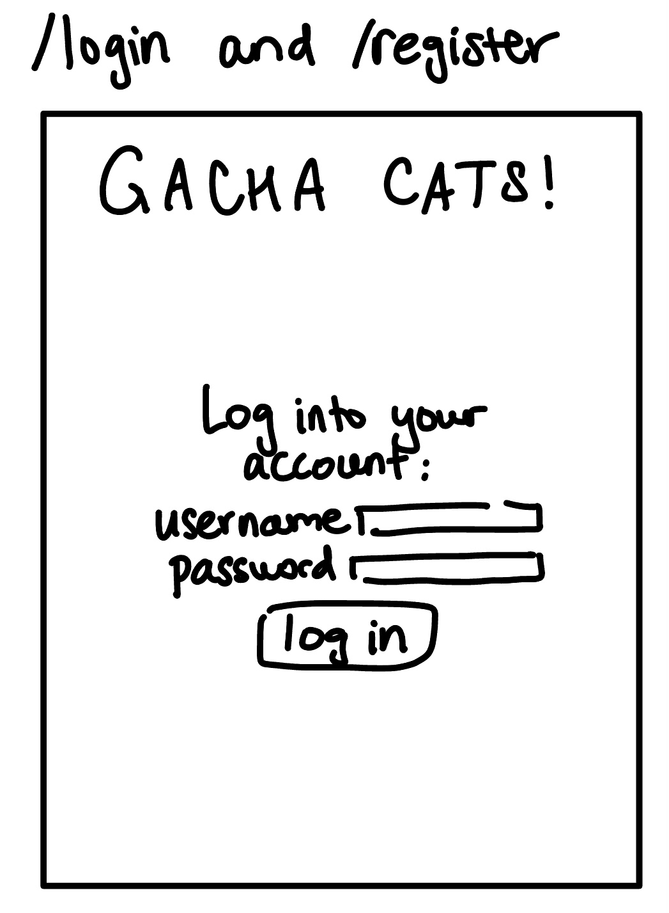
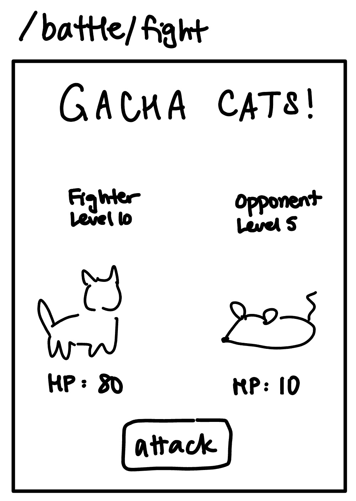
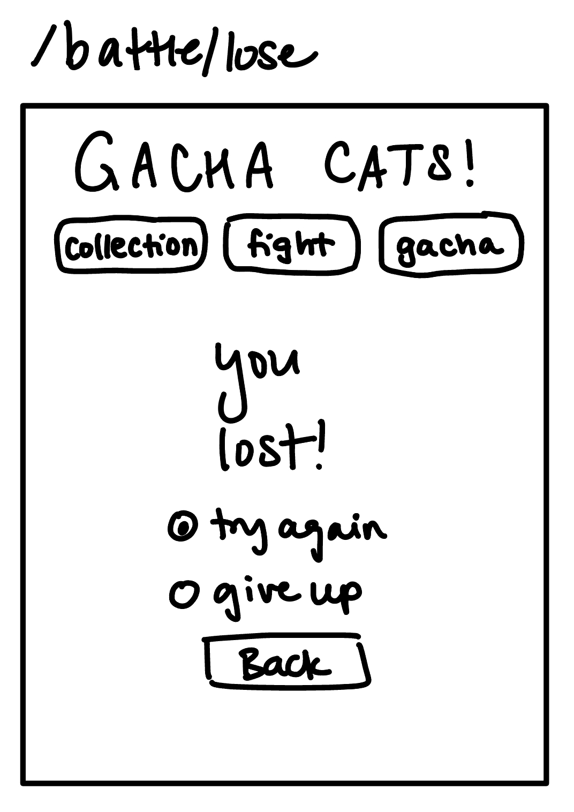

# Gacha Cats! 🐱

## Overview

"Gacha Cats!" is a web-based gacha fighting game. Google definition of a gacha game: “players spend in-game currency to receive a random in-game item”. In real life, a gacha is a toy vending machine similar to a gumball machine. In Gacha Cats!, players can register with a username and password. Once logged in, players can view their collection of awesome fighting cats, use a cat to engage in an automated turn-based battle against a computer opponent, and roll on the gacha to receive a random cat.

In battle, opponents are randomly chosen and are of varying difficulty. If the opponent runs out of HP first, the player wins and earns a reward of coins and fish, which scales based on the difficulty of the opponent. Coins can be used to roll on the gacha, and fish can be used to restore your cats' HP. If the player’s cat runs out of HP first, the player loses and that cat can no longer be used in battle until at least some of its HP is restored. The player can choose to either try again with this opponent, or give up. Trying again will allow the player to prepare for another battle with the same opponent. Giving up with randomly choose a new opponent for the player to face next time. The player’s level increases by 1 for every 10 battles they win.

In the gacha, a player can spend 10 coins to roll for a random cat to add to their collection (cats have different probabilities of being rolled - they can be common, uncommon, rare, or legendary). If the player rolls a cat that they already have in their collection, it will be converted to coins and fish instead.


## Data Model

The database will store Players and Cats.

* Players can have multiple Cats (via references)
* A Cat document holds the cat's data that are specific to this Player; each Cat also has some data that never changes and is the same across players, such as its image - this data is stored in a FighterProfile object
* The FighterProfile objects are stored in [catProfiles.mjs](src/catProfiles.mjs) and [opponentProfiles.mjs](src/opponentProfiles.mjs)

An example Player:
```javascript
{
  username: "testPlayer", // username, chosen by the player when registering their account
  winStreak: 0, // how many battles this player has won in a row, without losing
  coins: 1000, // in-game currency used for gacha
  fish: 10, // in-game currency used for restoring Cat HP
  playerLevel: 1, // (total # of battles won) / 10
  battleCounter: 0, // number of battles this player has won since they last leveled up, used for setting player level
  cats: [ ], // array of references to Cats documents; represents the Cats a player has
  currentOpponent: { } // a FighterProfile object that represents the current opponent this player is facing
}
```

An example Cat:

```javascript
{
  player: 0123456789, // a reference to the Player document to which this Cat belongs
  name: "My Ginger", // name that the player chose for this cat
  fighterProfile: { // a JavaScript object that stores the immutable information about this Cat
    name: "Ginger",
    subtitle: "Fierce orange warrior",
    type: "cat",
    image: "/img/ginger.png",
    maxHP: 50,
    powerLevel: 5,
    rarity: "common",
    rollProbability: 0.105
  },
  currentHP: 10, // increases if a fish is used on this Cat, decreases in battle
  battlesWon: 0 // how many battles this Cat has won in total
}
```


## [Link to Schema](src/db.mjs)


## Wireframes

/ - homepage where players who are not logged in can choose to either register a new account or log into an existing account


/login - page for either registering a new player, or logging into your existing account



/collection - home page of sorts, where players can see a visual representation of the fighters they currently have. If the player clicks on a fighter’s card, they can use heart capsules on that fighter; that is, they can decrease their heart capsule count by one to increase the fighter’s HP by 5 (unless the fighter is already at max HP).


/gacha - page where the player can roll on the gacha. If the player presses the button, they use 10 coins


/gacha/roll - the player gets to this page by clicking the “roll” button on the /gacha page. This page shows the fighter that was rolled on the gacha. Clicking “roll again” will reload this same page so the data on the page can be replaced with the new roll.


/battle/start - page where the player can set up for a battle. Shows a randomized computer opponent and allows the player to choose which one of their fighters they will use for the battle.


/battle/fight - the player gets to this page after they choose their fighter for this battle on the /battle/start page. Clicking “attack” will reload this same page so the data on the page can be replaced with the next turn. Every time “attack” is clicked, the opponent’s HP will decrease a random amount based on the fighter’s power level, and the fighter’s HP will decrease a random amount based on the opponent’s power level. The battle ends if either character’s HP reaches 0.



/battle/lose - page that player gets redirected to if they lose a battle



/battle/win - page that player gets redirected to if they win a battle. Shows their reward for winning.


In the header of the web app, it shows the title of the game, navigation buttons, player’s username, player’s current score, player’s level, and how many coins and heart capsules they have.

## [Site map](documentation/sitemap.png)

## User Stories or Use Cases

1. as non-registered user, I can register a new account with the game
2. as an already-registered user, I can log in to the game
3. as a user, I can see my basic player information at the top of the page
4. as a user, I can log out of my account by clicking the "Log out" button at the top of the page
5. as a user, I can view the entire collection of all the cats that I’ve obtained so far on the "collection" page
6. as a user, I can increase a cat's HP by clicking on a button to feed them a fish
7. as a user, I can choose one my cats to enter battle against a computer opponent
8. as a user, I can move to the next turn of a battle by clicking the "Attack" button during a battle
9. as a user, I can roll on the gacha by clicking the "Roll" button on the gacha page, to spend coins and receive a cat that will go in my collection
10. as a user, I can rename a newly-acquired cat from the gacha

## Research Topics

* (5 points) User authentication using PassportJS
* (1 point) Implemented gacha functionality using ChanceJS library
* (1 point) Session store w/o memory leaks using MemoryStore library
* (2 points) UI using Bootstrap, with a customized theme done in Sass (CUSTOM THEME IS WIP!!!)
* (1 point) User text input validation + sanitization using Validator library
* (1 point) Custom font using Google Fonts API

Total: 11 points

## [Link to Main Project File](src/app.mjs) 

## Project Requirements

###### 3 forms or AJAX interactions:
1. [Form to rename a newly-rolled cat](src/views/gacha-roll.hbs)
2. [Form to select a cat to enter battle](src/views/battle.hbs)
3. [AJAX interaction - "feed" buttons](src/views/collection.hbs) and (src/public/javascripts/collection.js)
Clicking on a cat card's "feed" button reduces player's fish count and increases that cat's HP, and displays this updated data on the page. This is implemented using Fetch to my own API [here](src/app.mjs).
###### 2 classes or higher-order functions
1. [FighterProfile class](src/fighterProfile.mjs)
2. [Use of map function to obtain cat roll probabilities](src/gacha.mjs)
###### Stability / security
1. [User input validation for all user text input](src/app.mjs)
2. [Escapes all user input before saving to DB](src/app.mjs)
3. Pages that require authentication will redirect to homepage if a player who is not logged in tries to access them through the URL bar
4. Players can never view each other's data


## Annotations / References Used

1. [passport.js authentication docs](http://passportjs.org/docs) - (src/app.mjs) and (src/auth.mjs)
2. [Professor Versoza's slides on passport.js](https://cs.nyu.edu/courses/fall22/CSCI-UA.0467-001/_site/slides/16/auth.html#/) - (src/app.mjs) and (src/auth.mjs)
3. [mongoose documentation](https://mongoosejs.com/docs)  - (src/db.mjs)
4. [mongoose stack overflow](https://stackoverflow.com/questions/33049707/push-items-into-mongo-array-via-mongoose) - (src/app.mjs)
5. [chance.js documentation](https://chancejs.com/usage/node.html) - (src/gacha.mjs), (src/battle.mjs), and (src/opponentProfiles.mjs)
6. [chance.js documentation for 'weighted' function](https://chancejs.com/miscellaneous/weighted.html) - (src/gacha.mjs) and (src/battle.mjs)
7. [chance.js documentation for 'pickOne' function](https://chancejs.com/helpers/pickone.html) - (src/opponentProfiles.mjs)
8. [memorystore documentation](https://www.npmjs.com/package/memorystore) - (src/app.mjs)
9. [MDN docs for Fetch API](https://developer.mozilla.org/en-US/docs/Web/API/Fetch_API/Using_Fetch) - (src/public/javascripts/collection.js) and (src/app.mjs)
10. [validator documentation](https://www.npmjs.com/package/validator) - (src/app.mjs)
11. [bootstrap documentation](https://getbootstrap.com/docs/5.2/customize/sass/) - (src/public/css/styles.css) and (src/public/scss/custom.scss)
12. [bootstrap customization with sass video tutorial](https://www.youtube.com/watch?v=6Ovw43Dkp44&ab_channel=Academind) - (src/public/scss/custom.scss)
13. [tutorial republic bootstrap tutorial](https://www.tutorialrepublic.com/twitter-bootstrap-tutorial/) - (src/views)
14. [mdbootstrap tutorial on margins](https://mdbootstrap.com/docs/standard/extended/margin/) - (src/views/layout.hbs)
15. [official bootstrap tutorial on grid system](https://getbootstrap.com/docs/4.0/layout/grid/) - (src/views/layout.hbs) and (src/views/collection.hbs)
16. [official bootstrap tutorial on radio buttons](https://getbootstrap.com/docs/5.0/forms/checks-radios/) - (src/views/battle-lose.hbs)
17. [w3schools bootstrap tutorial on radio buttons](https://www.w3schools.com/tags/att_input_type_radio.asp) - (src/views/battle-lose.hbs)
18. [w3schools favicon tutorial](https://www.w3schools.com/html/html_favicon.asp) - (src/views/layout.hbs)
19. [sass official guide](https://sass-lang.com/guide) - (src/public/scss/custom.scss)
20. [bootstrap color customization video tutorial](https://www.youtube.com/watch?v=au5ccstcbnc&ab_channel=PixelRocket) - (src/public/scss/custom.scss)
21. [changing size of bootstrap alert stack overflow](https://stackoverflow.com/questions/38379166/set-size-and-center-alert-box-in-twitter-bootstrap) - (src/public/scss/custom.scss)
22. [bootstrap width classes stack overflow](https://stackoverflow.com/questions/39033326/width-of-inputs-in-inline-form-bootstrap-4) - (src/views/battle.hbs)
23. [google fonts api documentation](https://developers.google.com/fonts/docs/getting_started) - (src/views/layout.hbs)