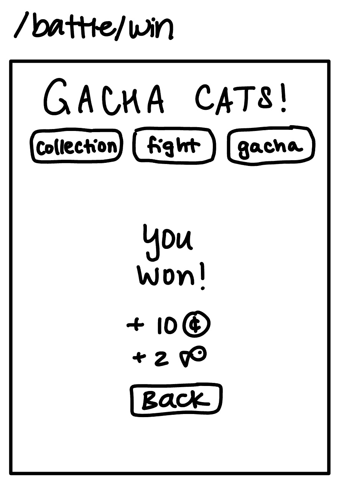

# Awesome Gacha!

## Overview

“Awesome Gacha” (working title) is a web-based gacha fighting game. Google definition of a gacha game: “players spend in-game currency to receive a random in-game item”. In real life, a gacha is a toy vending machine similar to a gumball machine. Players can register with a username and password. Once logged in, players can view their collection of fighters, use a fighter to engage in an automated turn-based battle against a computer opponent, or roll on the gacha to receive a random fighter.

In battle, if the opponent runs out of HP first, the player wins and they earn a reward of coins, which can be used in the gacha, and heart capsules, which can be used to restore their fighters’ HP. The player’s current score increases by 1. If the player’s fighter runs out of HP first, the player loses and that fighter can no longer be used in battle until some of its HP is restored. The player’s current score is reset to 0. The player’s level increases by 1 for every 10 battles they win. This level does not reset.

In the gacha, a player can spend 10 coins to roll for a random fighter to add to their collection (fighters have different probabilities of being rolled). If the player rolls a fighter that they already have in their collection, it will be converted to coins and heart capsules instead.


## Data Model

The application will store Players and Fighters, which can be affected by the user’s actions. It will also store immutable CharacterProfiles, which store unchangeable data such as images related to a specific character (a character is either a fighter or an opponent).

* Players can have multiple Fighters (via references)
* Each Fighter has one CharacterProfile (via reference)
* Fighter holds the fighter’s data that are specific to this Player; CharacterProfile holds the fighter’s data that never changes, such as name and images

An example Player:

```javascript
{
  username: "playerName",
  hash: // a password hash,
  currentScore: 0,
  coins: 0,
  heartCapsules: 0,
  playerLevel: 1,
  fighters: // array of references to Fighter documents
}
```

An example Fighter:

```javascript
{
  player: // a reference to a Player object
  characterProfile: // a reference to a CharacterProfile document
  currentHP: 10, // increases if a heart capsule is used on this Fighter, decreases in battle
  battlesWon: 0 // how many battles this fighter has won
}
```

An example CharacterProfile:

```javascript
{
  name: “Fighter Name”,
  image:  // image goes here,
  maxHP: 50,
  powerLevel: 5,
  rarity: common,
  rollProbability: 0.1 // probability either to receive fighter in gacha, or opponent in battle
}
```


## [Link to Commented First Draft Schema](db.js)


## Wireframes

/login - page for either registering a new player, or logging into your existing account


/collection - home page of sorts, where players can see a visual representation of the fighters they currently have. If the player clicks on a fighter’s card, they can use heart capsules on that fighter; that is, they can decrease their heart capsule count by one to increase the fighter’s HP by 5 (unless the fighter is already at max HP).


/gacha - page where the player can roll on the gacha. If the player presses the button, they use 10 coins


/gacha/roll - the player gets to this page by clicking the “roll” button on the /gacha page. This page shows the fighter that was rolled on the gacha. Clicking “roll again” will reload this same page so the data on the page can be replaced with the new roll.


/battle/start - page where the player can set up for a battle. Shows a randomized computer opponent and allows the player to choose which one of their fighters they will use for the battle.


/battle/fight - the player gets to this page after they choose their fighter for this battle on the /battle/start page. Clicking “attack” will reload this same page so the data on the page can be replaced with the next turn. Every time “attack” is clicked, the opponent’s HP will decrease a random amount based on the fighter’s power level, and the fighter’s HP will decrease a random amount based on the opponent’s power level. The battle ends if either character’s HP reaches 0.


/battle/lose - page that player gets redirected to if they lose a battle


/battle/win - page that player gets redirected to if they win a battle. Shows their reward for winning.



In the header of the web app, it shows the title of the game, navigation buttons, player’s username, player’s current score, player’s level, and how many coins and heart capsules they have.

## Site map

[site map](documentation/sitemap.png)

## User Stories or Use Cases

1. as non-registered user, I can register a new account with the game
2. as a user, I can log in to the game
3. as a user, I can view the entire collection of all the fighters that I’ve obtained so far
4. as a user, I can see my player information at the top of the screen
5. as a user, I can increase my fighters’ HP
6. as a user, I can enter battle by choosing one of my fighters to automatically “fight” a randomized computer opponent
7. as a user, I can roll on the gacha by spending coins to receive a fighter that will go in my collection

## Research Topics

* (5 points) Integrate user authentication using PassportJS
* (6 points) React
    * I would like to learn React to use as my front-end framework

11 points total out of 8 required points

## [Link to Initial Main Project File](app.js) 


## Annotations / References Used

1. [passport.js authentication docs](http://passportjs.org/docs)
2. [mongoose documentation for schemas with references](https://mongoosejs.com/docs/populate.html)  - (db.mjs)
3. [mongoose documentation for registering models](https://mongoosejs.com/docs/models.html)  - (db.mjs)
4. [storing images in mongoose](https://stackoverflow.com/questions/59833347/store-image-in-mongo-db-using-mongoose) - (db.mjs)
