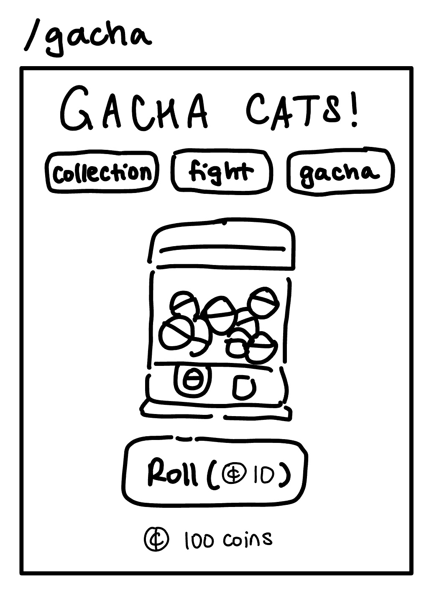
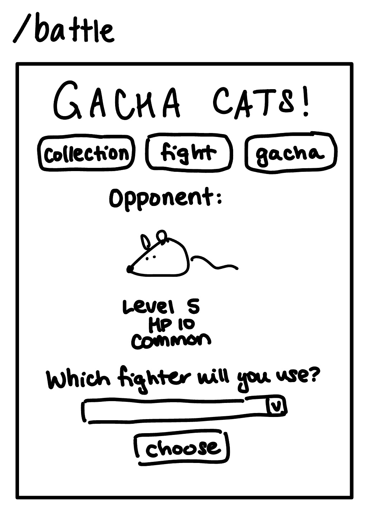

# Gacha Cats!

## Overview

"Gacha Cats" is a web-based gacha fighting game. Google definition of a gacha game: “players spend in-game currency to receive a random in-game item”. In real life, a gacha is a toy vending machine similar to a gumball machine. Players can register with a username and password. Once logged in, players can view their collection of fighters, use a fighter to engage in an automated turn-based battle against a computer opponent, or roll on the gacha to receive a random cat.

In battle, if the opponent runs out of HP first, the player wins and they earn a reward of coins, which can be used in the gacha, and fish, which can be used to restore their cats' HP. The player’s current score increases by 1. If the player’s cat runs out of HP first, the player loses and that cat can no longer be used in battle until some of its HP is restored. The player’s current score is reset to 0. The player’s level increases by 1 for every 10 battles they win. This level does not reset.

In the gacha, a player can spend 10 coins to roll for a random cat to add to their collection (cats have different probabilities of being rolled). If the player rolls a cat that they already have in their collection, it will be converted to coins and fish instead.


## Data Model

The database will store Players and Cats.

* Players can have multiple Cats (via references)
* A Cat document holds the cat's data that are specific to this Player; each Cat also has some data that never changes, such as its image - this data is stored in a FighterProfile object
* The FighterProfile objects are stored in [fighterProfile.mjs](fighterProfile.mjs), these include both cat profiles and opponent profiles

An example Player:
```javascript
{
  username: "testPlayer",
  winStreak: 0,
  coins: 1000,
  fish: 10,
  playerLevel: 1,
  cats: [ ] // an array of references to Cat documents
}
```

An example Cat:

```javascript
{
  player: 0123456789, // a reference to the Player document to which this Cat belongs
  name: "My Ginger",
  fighterProfile: { // a JavaScript object that stores the immutable information about this Cat
    name: "Ginger",
    subtitle: "Fierce orange warrior",
    type: "cat",
    image: "/img/test.png",
    maxHP: 50,
    powerLevel: 5,
    rarity: "common",
    rollProbability: 0.1
  },
  currentHP: 10, // increases if a fish is used on this Cat, decreases in battle
  battlesWon: 0 // how many battles this cat has won in total
}
```


## [Link to Commented First Draft Schema](db.mjs)


## Wireframes

/login - page for either registering a new player, or logging into your existing account


/collection - home page of sorts, where players can see a visual representation of the fighters they currently have. If the player clicks on a fighter’s card, they can use heart capsules on that fighter; that is, they can decrease their heart capsule count by one to increase the fighter’s HP by 5 (unless the fighter is already at max HP).


/gacha - page where the player can roll on the gacha. If the player presses the button, they use 10 coins



/gacha/roll - the player gets to this page by clicking the “roll” button on the /gacha page. This page shows the fighter that was rolled on the gacha. Clicking “roll again” will reload this same page so the data on the page can be replaced with the new roll.


/battle/start - page where the player can set up for a battle. Shows a randomized computer opponent and allows the player to choose which one of their fighters they will use for the battle.



/battle/fight - the player gets to this page after they choose their fighter for this battle on the /battle/start page. Clicking “attack” will reload this same page so the data on the page can be replaced with the next turn. Every time “attack” is clicked, the opponent’s HP will decrease a random amount based on the fighter’s power level, and the fighter’s HP will decrease a random amount based on the opponent’s power level. The battle ends if either character’s HP reaches 0.


/battle/lose - page that player gets redirected to if they lose a battle


/battle/win - page that player gets redirected to if they win a battle. Shows their reward for winning.


In the header of the web app, it shows the title of the game, navigation buttons, player’s username, player’s current score, player’s level, and how many coins and heart capsules they have.

## [Site map](documentation/sitemap.png)

## User Stories or Use Cases

1. as non-registered user, I can register a new account with the game
2. as a already-registered user, I can log in to the game
3. as a user, I can see my player information at the top of the screen (PARTIALLY IMPLEMENTED)
4. as a user, I can view the entire collection of all the cats that I’ve obtained so far on the "collection" page
5. as a user, I can increase my cats' HP by clicking a button to feed them a fish on the "collection" page (NOT YET IMPLEMENTED)
6. as a user, I can search the cats I have on the "collection" page (NOT YET IMPLEMENTED)
7. as a user, I can enter battle by choosing one of my cats to automatically “fight” a randomized computer opponent on the "battle" page (NOT YET IMPLEMENTED)
8. as a user, I can roll on the gacha by spending coins to receive a cat that will go in my collection on the "gacha" page
9. as a user, I can rename a newly-acquired cat on the "gacha roll" page

## Research Topics

* (5? points) User authentication using PassportJS
* (1 point) Implemented gacha functionality using ChanceJS
* (1 point) Session store w/o memory leaks using MemoryStore
* (2 points) Planning to use tailwind.css for the UI
* (? points) Currently looking for some additional libraries to use, specifically for animation and possibly other features

## [Link to Initial Main Project File](app.js) 


## Annotations / References Used

1. [passport.js authentication docs](http://passportjs.org/docs) - (app.mjs) and (auth.mjs)
2. [mongoose documentation](https://mongoosejs.com/docs)  - (db.mjs)
3. [mongoose stack overflow](https://stackoverflow.com/questions/33049707/push-items-into-mongo-array-via-mongoose) - (app.mjs)
4. [chance.js documentation](https://chancejs.com/usage/node.html) - (gacha.mjs)
5. [chance.js documentation for 'weighted' function](https://chancejs.com/miscellaneous/weighted.html) - (gacha.mjs)
6. [memorystore documentation](https://www.npmjs.com/package/memorystore) - (app.mjs)